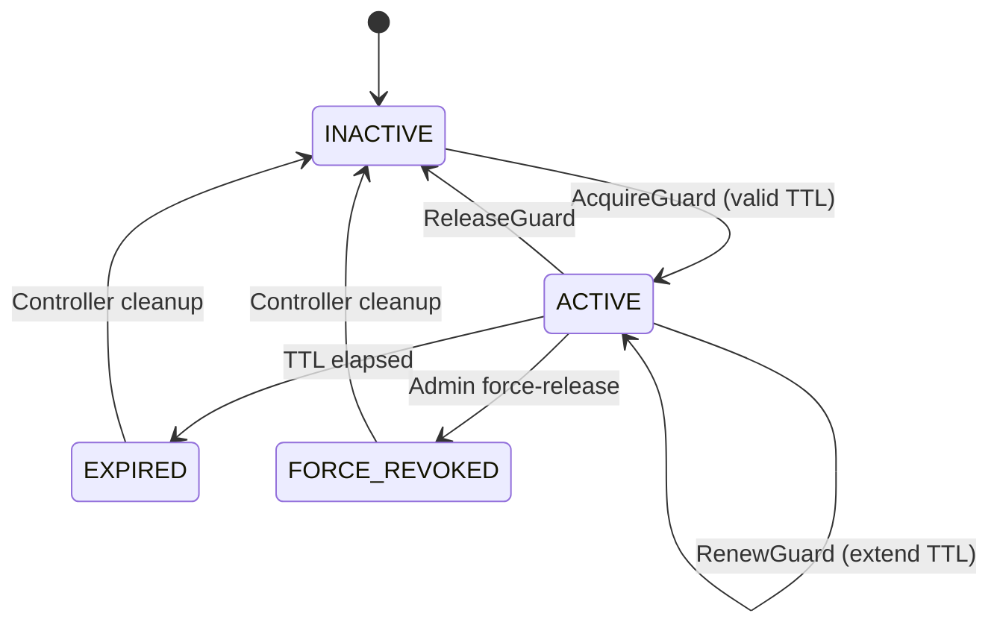
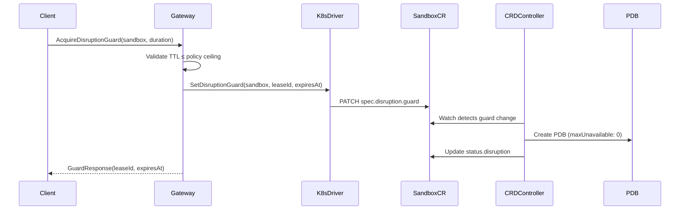
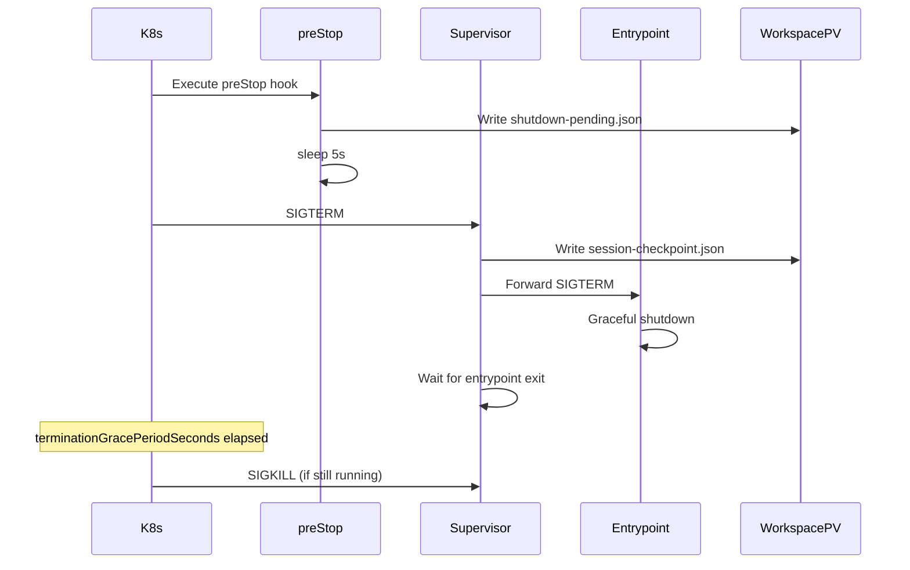
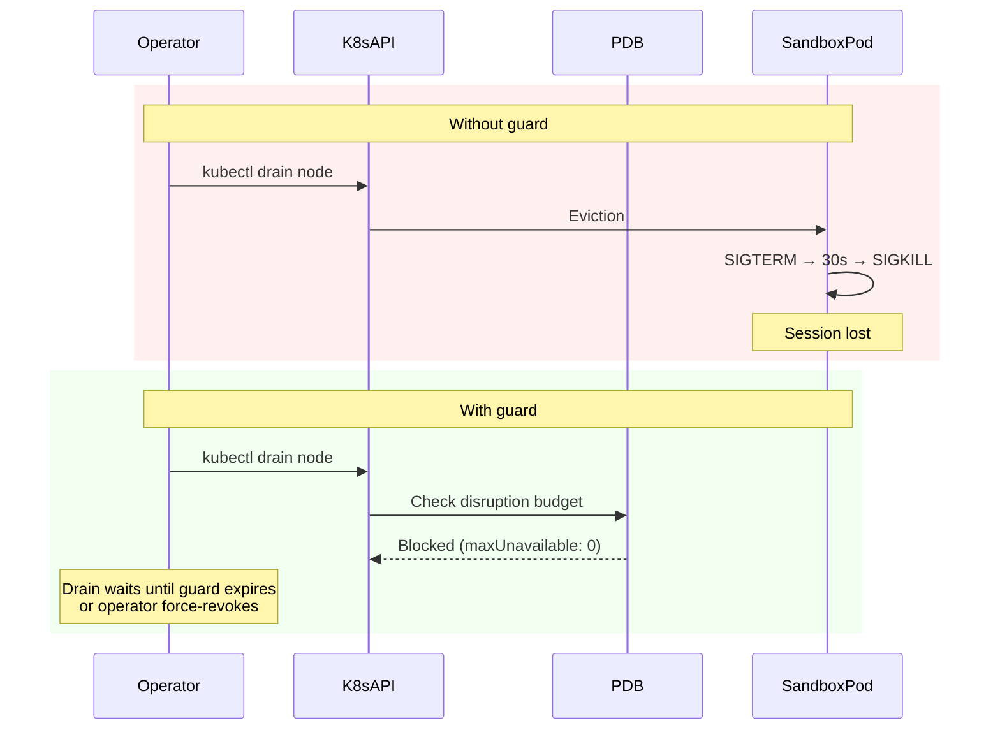

---
authors:
  - "@derekwaynecarr"
state: draft
---

# RFC 0013 - Sandbox Disruption Resilience

## Summary

OpenShell sandbox pods on Kubernetes have no protection against voluntary disruption. When a node is drained for upgrades, resource rebalancing, or autoscaler scale-down, the sandbox pod is evicted and the agent session is destroyed. The `/workspace` PV preserves filesystem state, but conversation context, in-flight tool calls, and streaming state are lost. For long-horizon agent sessions that run for hours, this wastes significant time and tokens with no recovery path.

This RFC proposes a **lease-based disruption guard** that creates a PodDisruptionBudget for sandbox pods during bounded critical sections, a **disruption policy stanza** that gives operators control over guard behavior, and a **graceful shutdown foundation** that provides a checkpoint window when eviction is unavoidable. The guard is managed through the Sandbox CRD and reconciled by the CRD controller, keeping PDB lifecycle aligned with pod ownership.

## Motivation

Agent sessions running inside OpenShell sandboxes are stateful, long-running processes. A coding agent working through a complex task may run for three or more hours, accumulating conversation context, tool call history, and in-progress work that exists only in memory. The `/workspace` PV preserves files written to disk, but the agent's session state — which represents the majority of the accumulated value — lives in the supervisor process and the agent runtime. When the pod is killed, this state is gone.

Kubernetes voluntary disruption is routine infrastructure maintenance, not an exceptional event. Node upgrades via `kubectl drain`, cluster autoscaler scale-down, spot instance reclamation, and resource rebalancing all evict pods through the Eviction API. Without a PodDisruptionBudget, the eviction proceeds immediately. Today, OpenShell sandbox pods have no PDB, no `terminationGracePeriodSeconds` beyond the Kubernetes default of 30 seconds, no preStop lifecycle hooks, and no coordination between the supervisor's SIGTERM handler and the gateway.

Users connected via the TUI SSH tunnel observe the connection drop from the gateway side with no explanation. Upon reconnecting, the sandbox pod has been recreated — the Sandbox CR persists and the CRD controller provisions a new pod — but the agent is no longer running and the session is lost. There is no indication of whether the interruption was caused by eviction, a crash, or user action. There is no checkpoint to resume from.

The existing `priority_class_name` passthrough in `KubernetesPodDriverConfig` allows operators to influence scheduling order, but priority classes do not prevent voluntary eviction via `kubectl drain`. There is no mechanism for a sandbox, user, or agent to signal "this session is in a critical section — defer eviction." The only workaround is to never drain nodes running sandboxes, which is impractical on shared clusters and blocks routine infrastructure maintenance.

Without this RFC, operators face an unresolvable tension: cluster maintenance requires node drains, but node drains destroy active agent sessions. This blocks adoption of OpenShell on shared Kubernetes clusters and forces operators to choose between infrastructure hygiene and agent reliability.

## Non-goals

- **Full session checkpoint and restore.** This RFC provides a graceful shutdown window and a checkpoint breadcrumb file, not a mechanism to serialize and restore conversation context, tool call queues, or streaming state. Full session resumption is a separate effort that builds on the foundation established here.

- **Protection against involuntary eviction.** OOM kills, node failures, and kernel panics bypass PDBs entirely. The story for involuntary eviction remains: the workspace PV preserves filesystem state, session state is lost. Future work may address this through external state streaming.

- **Live migration of sandbox pods.** Moving a running sandbox from one node to another without interruption is not addressed.

- **Cross-driver disruption support.** The disruption guard primitive is defined for the Kubernetes driver. Docker, Podman, and VM drivers do not have an equivalent eviction model and are not covered.

- **Indefinite eviction blocking.** Guards have mandatory TTLs with policy-enforced ceilings. Operators can force-revoke guards at any time. Sandboxes cannot become permanently undrainable.

- **Agent-autonomous session serialization.** The agent's own logic for checkpointing its state (conversation history, tool call results) is out of scope. The RFC provides the signal and window; the agent decides what to do with it.

- **Multi-sandbox disruption coordination.** Group disruption budgets, gang scheduling, and coordinated eviction of related sandboxes are not addressed.

## Proposal

### Disruption guard model

The disruption guard is a lease-based primitive that prevents voluntary eviction of a sandbox pod for a bounded period. A guard has four states:



Each guard carries a `lease_id` (UUID), `acquired_at` timestamp, `expires_at` timestamp, and `acquired_by` identity (user, agent, or system). Guards are one-at-a-time per sandbox — acquiring a new guard while one is active replaces it. The TTL is mandatory and bounded by a policy-enforced ceiling. Guards can be renewed (extending the TTL) before expiry, up to the ceiling.

When a guard is `ACTIVE`, a PodDisruptionBudget with `maxUnavailable: 0` exists for the sandbox pod, blocking the Kubernetes Eviction API. When the guard transitions out of `ACTIVE` (released, expired, or force-revoked), the PDB is deleted and normal eviction resumes.

### Policy surface

A new `disruption` stanza in the sandbox policy controls guard behavior:

```yaml
disruption:
  max_guard_duration_seconds: 14400  # 4 hours, operator ceiling
  allow_agent_acquisition: false     # whether the agent process can self-acquire
  termination_grace_period_seconds: 60
  enable_pre_stop_hook: true
```

This maps to a `DisruptionPolicy` message in `sandbox.proto`:

```protobuf
message DisruptionPolicy {
  uint32 max_guard_duration_seconds = 1;
  bool allow_agent_acquisition = 2;
  uint32 termination_grace_period_seconds = 3;
  bool enable_pre_stop_hook = 4;
}
```

The `DisruptionPolicy` is added to `SandboxPolicy` alongside the existing typed stanzas (`FilesystemPolicy`, `LandlockPolicy`, `ProcessPolicy`). The stanza is optional — absence means default values apply. The `max_guard_duration_seconds` field controls the ceiling for guard TTLs; setting it to `0` disables guards entirely for that sandbox class. The `allow_agent_acquisition` field gates whether the agent process inside the sandbox can acquire a guard through the supervisor's gateway connection; default `false` requires explicit user or API action.

The policy stanza lives in `sandbox.proto` rather than `driver_config` because the guard crosses the gateway/driver boundary: the gateway validates TTL bounds and authorizes acquisition, the driver patches the Sandbox CR, and the CRD controller reconciles the PDB.

### Sandbox CRD extensions

The Sandbox CR spec and status gain disruption-related fields. The gateway (via the K8s driver) writes the desired guard state to the CR spec; the CRD controller reads it, reconciles the PDB, and reports observed state in the CR status.

**Spec fields** (set by the gateway):

```yaml
spec:
  disruption:
    guard:
      leaseId: "uuid"
      expiresAt: "2024-01-15T14:30:00Z"
      acquiredBy: "user:alice"
    terminationGracePeriodSeconds: 60
```

**Status fields** (set by the CRD controller):

```yaml
status:
  disruption:
    guard:
      state: ACTIVE    # INACTIVE | ACTIVE | EXPIRED | FORCE_REVOKED
      leaseId: "uuid"
      expiresAt: "2024-01-15T14:30:00Z"
    pdb:
      name: "sandbox-abc123-guard"
      active: true
```

The CRD controller's reconciliation loop watches the `spec.disruption.guard` field:

- When `leaseId` is set and `expiresAt` is in the future: create or ensure a PDB with `maxUnavailable: 0` selecting the sandbox pod, set `status.disruption.guard.state` to `ACTIVE`.
- When `expiresAt` has passed: delete the PDB, set state to `EXPIRED`, clear the spec guard fields.
- When the spec guard fields are cleared (release or force-revoke): delete the PDB, set state to `INACTIVE`.

The controller must run its own expiry check — it cannot depend on the gateway to clear expired guards, because the gateway may be unavailable during a drain event. This autonomous cleanup is critical: an expired guard with an orphaned PDB would block drains indefinitely.



### Gateway and compute driver changes

Four new RPCs on the `OpenShell` gRPC service:

- `AcquireDisruptionGuard` — validate requested duration against the sandbox's effective policy ceiling, generate a `lease_id`, compute `expires_at`, patch the Sandbox CR via the K8s driver, return the lease.
- `ReleaseDisruptionGuard` — clear the guard fields on the Sandbox CR. Accepts a `force` flag for operator override (bypasses the `acquired_by` ownership check).
- `RenewDisruptionGuard` — extend `expires_at` on an active guard. The new expiry must not exceed the policy ceiling measured from the original `acquired_at`.
- `GetDisruptionGuard` — return current guard state for a sandbox.

Authorization follows existing patterns: `AcquireDisruptionGuard` and `RenewDisruptionGuard` require `sandbox:write` scope. `ReleaseDisruptionGuard` with `force: true` requires platform admin authorization. Agent acquisition uses `sandbox` auth mode, gated by `allow_agent_acquisition`.

The K8s compute driver gains a method for patching disruption guard fields on the Sandbox CR. This is a targeted PATCH operation on `spec.disruption.guard`, using the existing `DynamicObject` API. A new RPC in `compute_driver.proto` may be needed:

```protobuf
rpc SetDisruptionGuard(SetDisruptionGuardRequest) returns (SetDisruptionGuardResponse);
```

The `SandboxStatus` message in `openshell.proto` gains a `DisruptionGuardStatus` field so that `GetSandbox` and `ListSandboxes` responses surface guard state. This gives operators visibility into which sandboxes are holding guards, when they expire, and whether PDBs are active — critical information when planning a node drain.

RBAC: the gateway's Kubernetes Role in `deploy/helm/openshell/templates/role.yaml` needs `poddisruptionbudgets` permissions (`create`, `delete`, `get`, `list`, `watch`) in the `policy/v1` API group. Even if the CRD controller manages PDBs directly, the gateway role may need read access for status reporting.

### SIGTERM grace period and preStop hooks

Today, sandbox pods have no `terminationGracePeriodSeconds` set (defaulting to the Kubernetes default of 30 seconds), no preStop lifecycle hooks, and no coordinated shutdown between the supervisor and the gateway.

The K8s driver's pod spec construction (`sandbox_to_k8s_spec` and `sandbox_template_to_k8s_with_validated_config` in `crates/openshell-driver-kubernetes/src/driver.rs`) is extended to:

1. Set `terminationGracePeriodSeconds` on the pod template from the disruption policy stanza (default: 60 seconds). This gives the supervisor more time to forward SIGTERM and wait for the entrypoint to exit.

2. Inject a preStop lifecycle hook on the supervisor container. The hook writes a shutdown sentinel file to the workspace PV and sleeps briefly to allow the supervisor to begin its shutdown sequence before SIGTERM arrives:

```yaml
lifecycle:
  preStop:
    exec:
      command:
        - /bin/sh
        - -c
        - |
          mkdir -p /workspace/.openshell
          echo '{"reason":"eviction","timestamp":"'$(date -u +%FT%TZ)'"}' \
            > /workspace/.openshell/shutdown-pending.json
          sleep 5
```

The supervisor's SIGTERM handler in `crates/openshell-supervisor-process/src/run.rs` (`wait_for_supervisor_shutdown_signal`) is extended to write a checkpoint breadcrumb before forwarding SIGTERM to the entrypoint:

```json
{
  "session_id": "uuid",
  "sandbox_id": "uuid",
  "timestamp": "2024-01-15T14:30:00Z",
  "reason": "sigterm",
  "entrypoint_pid": 42,
  "entrypoint_running": true
}
```

This file is written to `/workspace/.openshell/session-checkpoint.json`. It does not contain conversation context or tool call state — that is a non-goal of this RFC. It provides a signal that the session was interrupted by infrastructure rather than user action, and a breadcrumb for future session resumption implementations to build on.

On supervisor startup, the supervisor checks for the checkpoint file and logs its presence. This enables the TUI and CLI to display "this sandbox was previously interrupted by eviction" rather than presenting a blank slate with no context.



### Operator visibility and controls

Operators need to answer three questions during cluster maintenance: which sandboxes are holding disruption guards, when those guards expire, and how to force-drain if necessary.

**Sandbox status.** The `DisruptionGuardStatus` field on `SandboxStatus` surfaces guard state, expiry time, and PDB name in `GetSandbox` and `ListSandboxes` responses. The TUI and CLI can render this directly.

**Force-revoke.** Platform administrators can call `ReleaseDisruptionGuard` with `force: true` to override any active guard. This clears the Sandbox CR spec, the CRD controller deletes the PDB, and the sandbox becomes drainable. This is the escape hatch for urgent maintenance.

**Helm chart defaults.** New values in `values.yaml`:

```yaml
sandbox:
  disruption:
    defaultMaxGuardDurationSeconds: 14400
    defaultTerminationGracePeriodSeconds: 60
    defaultPriorityClassName: ""
```

The `defaultPriorityClassName` provides a cluster-wide default for sandbox pod priority, replacing the current passthrough-only pattern where each sandbox must set it individually via `driver_config`.

**Eviction behavior comparison:**



## Implementation plan

The implementation is structured in three phases. Phase 1 ships independently and has no dependency on CRD controller changes or new gateway RPCs. Phase 2 is the core guard mechanism. Phase 3 adds agent-side acquisition and operational tooling.

### Phase 1: Graceful shutdown foundation

This phase improves the eviction experience immediately, without the full guard mechanism.

- Add `termination_grace_period_seconds` to the disruption policy stanza in `sandbox.proto` and the `openshell-policy` crate's YAML serde types.
- Extend `sandbox_to_k8s_spec` in the K8s driver to set `terminationGracePeriodSeconds` on the pod template and inject the preStop lifecycle hook.
- Extend the supervisor's SIGTERM handler (`wait_for_supervisor_shutdown_signal` in `crates/openshell-supervisor-process/src/run.rs`) to write the checkpoint breadcrumb file before forwarding SIGTERM.
- Add checkpoint file detection on supervisor startup with a log message.
- Update the Helm chart `values.yaml` with `sandbox.disruption.defaultTerminationGracePeriodSeconds`.
- Tests: verify preStop hook injection in generated pod specs, checkpoint file write on simulated SIGTERM, file detection on startup.

### Phase 2: Disruption guard core

This phase introduces the guard mechanism end-to-end.

- Add `DisruptionPolicy` and `DisruptionGuardStatus` messages to `sandbox.proto`.
- Add guard RPCs (`AcquireDisruptionGuard`, `ReleaseDisruptionGuard`, `RenewDisruptionGuard`, `GetDisruptionGuard`) to `openshell.proto`.
- Add `SetDisruptionGuard` to `compute_driver.proto` (if needed; alternatively, use the existing CR patch mechanism).
- Implement gateway guard logic: TTL validation against policy, lease generation, CR patching via the K8s driver.
- Implement K8s driver CR patching for `spec.disruption.guard` fields.
- Define the CRD controller contract for PDB reconciliation and expiry cleanup (coordinate with controller maintainers for implementation).
- Add `DisruptionGuardStatus` to `SandboxStatus` in `openshell.proto`.
- Update RBAC in `deploy/helm/openshell/templates/role.yaml` to include `poddisruptionbudgets` permissions.
- Add Helm chart values for `sandbox.disruption.defaultMaxGuardDurationSeconds` and `sandbox.disruption.defaultPriorityClassName`.
- Tests: guard lifecycle state machine, TTL enforcement and ceiling validation, PDB creation/deletion (integration test with CRD controller), RBAC validation, expiry cleanup.

### Phase 3: Agent acquisition and observability

This phase enables agents to self-manage guards and adds operational tooling.

- Add supervisor-to-gateway guard acquisition RPC (via the existing `ConnectSupervisor` bidirectional stream or a new sandbox-auth RPC).
- Implement `allow_agent_acquisition` policy gate in the gateway.
- Add metrics: `openshell_sandbox_disruption_guard_active` gauge, `openshell_sandbox_disruption_guard_expired_total` counter.
- Add guard status display in the TUI sandbox view, including eviction history from checkpoint files.
- Add CLI commands: `openshell sandbox guard acquire`, `release`, `status`.
- Documentation: operator guide for disruption management, policy configuration reference.

## Risks

- **Guards delaying cluster maintenance.** If many sandboxes hold active guards simultaneously, a node drain could be blocked for the duration of the longest guard TTL. Mitigation: the mandatory TTL ceiling bounds the worst case, operator force-revoke provides an escape hatch, and `ListSandboxes` surfaces guard state for planning. Remaining risk: operators must be aware of the force-revoke mechanism before performing maintenance.

- **CRD controller dependency.** PDB reconciliation requires changes to the Sandbox CRD controller, which may be maintained by a separate team. If the controller cannot implement the guard contract promptly, Phase 2 is blocked. Mitigation: Phase 1 ships independently, the controller contract is specified precisely enough for independent implementation, and the alternative of driver-managed PDBs is available as a fallback.

- **PDB does not prevent involuntary eviction.** Users may develop false confidence that a guard protects their session against all disruption. OOM kills, node failures, and preemption by higher-priority pods bypass PDBs entirely. Mitigation: documentation and status messages must clearly distinguish voluntary disruption (which guards prevent) from involuntary disruption (which they do not).

- **Checkpoint breadcrumb is not session restore.** The breadcrumb file signals that an eviction occurred but does not enable resuming the agent session. Users expecting "resume where I left off" will be disappointed. Mitigation: the RFC explicitly scopes full session restore as a non-goal and future effort; the breadcrumb is positioned as a foundation, not a solution.

- **RBAC escalation surface.** Granting `poddisruptionbudgets` permissions in the gateway Role allows creation of PDBs that could interfere with cluster operations beyond sandbox management. Mitigation: PDBs are scoped to the sandbox namespace, labeled for OpenShell ownership, and garbage-collected by the CRD controller when guards expire. The gateway does not create PDBs for arbitrary workloads.

- **Complexity in an evolving API.** Adding disruption semantics to the Sandbox CRD and gateway API increases the surface area of a still-maturing system. Mitigation: the disruption policy stanza and guard RPCs are additive — they do not modify existing behavior. The stanza is optional with sensible defaults. The guard mechanism can be disabled entirely by setting `max_guard_duration_seconds: 0`.

## Alternatives

### 1. PDB managed by the K8s driver directly

The gateway or K8s driver creates PDBs directly using the Kubernetes API instead of writing guard state to the Sandbox CR and delegating to the CRD controller. This is simpler to implement — no CRD controller changes needed — but violates the existing ownership model. The driver creates Sandbox CRs via `DynamicObject` (not pods directly); the CRD controller owns the pod lifecycle. PDB ownership should follow pod ownership to avoid split-brain scenarios where the driver and controller have conflicting views of whether a sandbox pod should be protected. If the CRD controller is unavailable or slow to adopt the guard contract, this alternative serves as a viable fallback.

### 2. Permanent PDB on all sandbox pods

Create a PDB with `maxUnavailable: 0` for every sandbox pod at creation time, unconditionally. This eliminates the need for lease logic, guard RPCs, and policy configuration. However, it makes cluster maintenance impossible — operators could never drain a node running any sandbox pod without first deleting the sandbox. This is incompatible with shared Kubernetes clusters and violates Kubernetes best practice that PDBs should be scoped to the actual disruption sensitivity of the workload.

### 3. Priority classes only

Use Kubernetes PriorityClasses to give sandbox pods high scheduling priority, reducing the likelihood of preemption. Priority classes influence scheduler behavior — higher-priority pods are scheduled before lower-priority ones, and lower-priority pods may be preempted to make room. However, priority classes do not prevent voluntary eviction via `kubectl drain`. A node drain evicts all pods regardless of priority. Priority classes are a complementary mechanism — the RFC recommends a `defaultPriorityClassName` Helm value — but they do not solve the core problem.

### 4. Do nothing

Accept that sandbox sessions are lost on eviction and document the limitation. Operators would need to avoid draining nodes that run sandbox pods (using `kubectl drain --pod-selector` to exclude them) or accept session loss as a cost of maintenance. This pushes complexity entirely to operators, is fragile, and blocks adoption of OpenShell on shared clusters where dedicated scheduling is impractical.

## Prior art

**Kubernetes PodDisruptionBudgets.** The native mechanism for protecting workloads from voluntary disruption. StatefulSet operators for databases commonly create PDBs during leader election or replication catchup — periods where disruption would cause data loss or extended unavailability. The lease-based guard applies the same pattern to transient critical sections (active agent sessions) rather than permanent workload roles.

**Kubernetes Job `terminationGracePeriodSeconds`.** Kubernetes batch Jobs use extended termination grace periods to allow long-running work to checkpoint before being killed. ML training jobs commonly set grace periods of 5-10 minutes to write model checkpoints. The same pattern applies to sandbox pods: the agent's accumulated session state is analogous to a training checkpoint, and the grace period provides a window to preserve it.

**Cloud VM preemption notices.** GCP Spot VMs (30 seconds), AWS Spot Instances (2 minutes), and Azure Spot VMs (30 seconds) provide advance notice before termination. The preStop hook and extended `terminationGracePeriodSeconds` serve an equivalent function in the Kubernetes context — providing a structured window for cleanup before the process is killed.

**Database operator lease-based PDBs.** CockroachDB, Vitess, and TiDB operators create and delete PDBs dynamically based on cluster state. A CockroachDB operator creates a PDB while a range is underreplicated and removes it when replication catches up. The disruption guard follows this established pattern: create the PDB when the session enters a critical section, remove it when the section completes or the lease expires.

## Open questions

- Should the disruption guard be a typed field on the Sandbox CR spec (requiring CRD schema changes) or a set of annotations that the controller watches? Typed fields are more discoverable and validated by the API server, but require CRD version coordination. Annotations are more flexible but less safe.

- Should the PDB use `maxUnavailable: 0` or `minAvailable: 1`? For single-pod sandboxes these are semantically equivalent, but the choice affects behavior if sandbox pods ever scale beyond one replica.

- Should guard acquisition require explicit action (API call from user or agent), or should the gateway auto-acquire a guard when a supervisor connects and an agent session starts? Auto-acquisition simplifies the user experience but removes user control and creates PDBs for sessions that may not need protection.

- What is the appropriate default for `max_guard_duration_seconds`? Four hours covers most agent sessions but could delay cluster maintenance if many guards are active. A lower default (one hour) with documentation encouraging operators to raise it may be more prudent for shared clusters.

- Should the checkpoint breadcrumb file include session metadata sufficient for a future resumption implementation (sandbox config hash, policy version, provider state) or be minimal (eviction signal only)? Including metadata increases coupling with the as-yet-undesigned resumption mechanism.

- How should the system handle an active guard when the supervisor has disconnected (supervisor crash while guard is held)? The PDB prevents eviction but the session is already gone. Options: auto-release the guard on supervisor disconnect, or preserve it in case the supervisor reconnects.

- Should the CRD controller or the gateway be responsible for expired guard cleanup? If the gateway is unavailable during a drain event, expired guards with orphaned PDBs would block drains indefinitely. The controller should have autonomous expiry cleanup, but this requires the controller to interpret the `expiresAt` timestamp — is that complexity acceptable?
